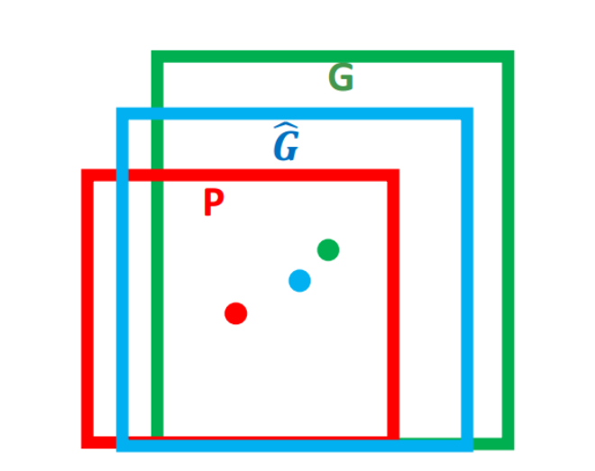
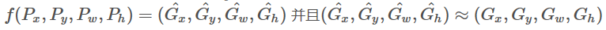
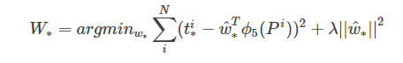
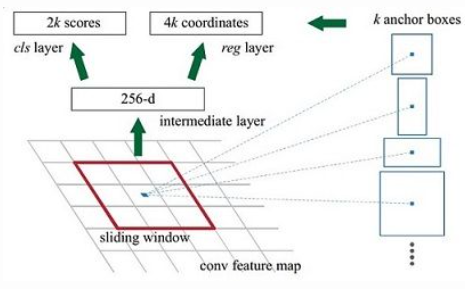
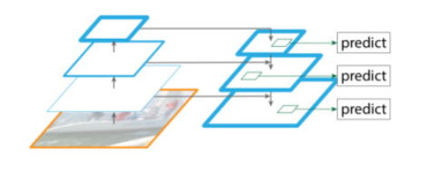
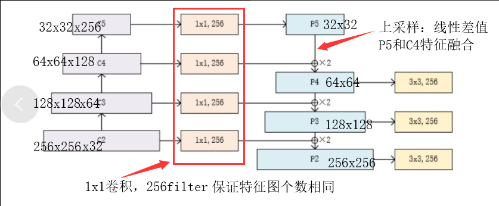
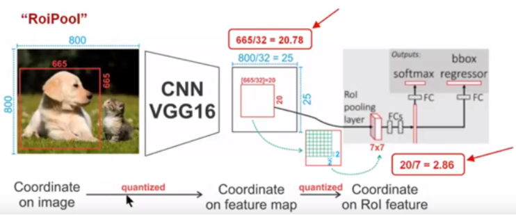
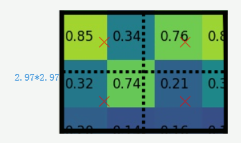
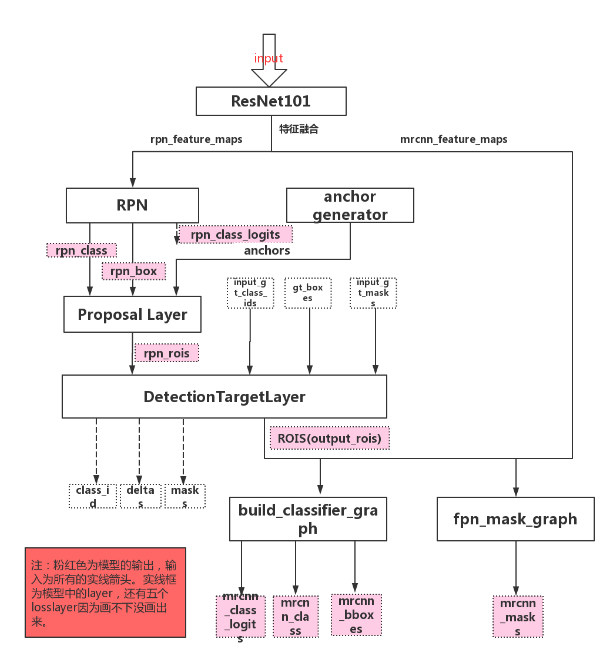

#  MASK-RCNN

> 前置知识：

SPPNet：其实就是加入了ROI池化层的CNN，使得网络的输入图像可以是任意尺寸的。

**ROI池化层运用到目标检测中的原因：**

因为在原始图像的候选框（大小各异）中，实际上可以对应到卷积特征中相同位置的框，这样就可以利用ROI池化层将卷积特征中不同形状的区域对应到同样长度的向量特征。

最终就可以将原始图像中不同长度的区域都对应到一个固定长度的向量特征，这就完成了各区域特征提取的工作。

**SPPNet与R-CNN不同点：**

RCNN要对每个区域进行计算卷积，而SPPNet只需要计算一次，效率提高了。

**框回归（**bounding-box regression**）：**（`Fast R-CNN`）

实际上是对原始检测框进行一定程度的“校准“，因为使用`selective Search`获得框有时会存在一定的偏差。

概念：

对于窗口一般使用四维向量（x, y, w, h）,分别表示窗口的中心坐标和宽高。对于下图，红色框P表示原始的Proposal， 绿色的框G表示目标的Ground Truth，我们的目标就是**寻找一种关系是的输入原始的窗口P经过映射得到一个跟真实窗口G更接近的回归窗口`G^`**

边框回归的目的就是， 给定(Px,Py,Pw,Ph)寻找一种映射f，使得

**解决方案：** （平移+尺度放缩）

R-CNN论文中给出了具体的变换过程，这里不做过多介绍，[详细点这里](https://arxiv.org/pdf/1311.2524.pdf)

**<u>Input：</u>**P窗口对应的CNN特征（R-CNN 中的 Pool5 feature 特征向量）(P=(Px,Py,Pw,Ph))、Ground Truth（t∗=(tx,ty,tw,th)）。

**<u>Output：</u>**需要进行平移变换和尺度缩放（Δx,Δy,Sw,Sh）

**<u>学习参数：</u>**{(x‘-x)/w),  (y’-y)/h,  ln(w'/w),  ln(h'/h)},前俩个数表示与尺度无关的平移量，后俩个数表示和尺度无关的缩放量。

**<u>优化目标：</u>** 

t∗表示真实值，后一项表示经过平移+尺度缩放之后的生成值。

w∗是要学习的参数（*表示 x,y,w,h， 也就是每一个变换对应一个目标函数）

**RPN（Region Proposal Networks）:**(`faster-RCNN)`

核心思想：RPN网络用于生成region proposals。该层通过softmax判断anchors属于positive或者negative，再利用bounding box regression修正anchors获得精确的proposals。

过程：

1.RPN需要一个前置的·CNN来提取特征，假设这里提取的特征为 51x39x256  。

2.对这个卷积特征再进行一次卷积计算，保持宽、高、通道数不变，51x39x256

3.卷积特征中每一个位置点都负责原图中的9种框的检测，一共 51x39x9个框，目标是判断框中是否存在一个物体

​         9种框（这里的框称为“anchor”）：面积为 128^2, 256^2, 512^2, 每种面积又分为三种长宽比 2:1,1:2, 1:1.

4. 

​      利用一个3x3的窗口在特征向量上进行滑动，每经过一个特征（对应k个anchor，k在这里也就是9），就将这个位置转换为统一的256维的特征：

​         256维特征包含俩部分输出：

​                                         （1）表示该位置的anchor是物体的概率 ，长度为2xk（是物体的概率+不是物体的概率）

​                                         （2）一个anchor对应的框回归的四个参数，长度为4xk

## FPN(特征金字塔网络)

基本思想：将多个阶段特征图融合在一起，这就相当于既有了高层的语义特征，也有了低层的轮廓特征。

> 注意：
>
> * 不改变特征图大小的层归为一个阶段
> * 每次抽取的特征都是每个阶段的最后一层输出

## RPN(MASK R-CNN)

> RPN中k的值在MASK R-CNN 中为3

经过RPN层 得到三个返回结果， 分数值（背景，前景的分数值，也是是否为物体的分数值）、概率值（把分数值加一层softmax转化为是否为物体的概率值）、回归值（框回归的参数）

## ProposalLayer（得到筛选过后有效的候选框）

**作用：**

* 对20W+的候选框进行过滤，先按照前景得分排序

* 取2000（这个数据由数据集决定）个得分高的，把之前得到的每个框回归的值都利用上

* NMS再过滤（非极大值抑制）：

  设置IOU阈值（重叠指标），来将高度重叠的框，将前景得分值最高的框留下

## DetectionTargetLayer（得到正负样本数据）

* 1.之前得到2000个ROI， 可能有pad进来（0 padding），这些去掉
* 2.有的数据集的一个框包括多个物体，这样的情况剔除
* 3.判断正负样本，基于ROI和GT，通过IOU与默认阈值0.5进行判断
* 4.设置负样本数量是正样本而定3倍，总数默认为400
* 5.每一个正样本（ROI），需要得到其类别，用IOU最大的那个GT
* 6.每一个正样本（ROI），需要得到其与GT-BOX的偏移量
* 7.每一个正样本（ROI），需要得到其最接近的GT-BOX对应的MASK
* 8.返回所有结果，其中负样本偏移量和MASK都用0填充

## ROI-Align Layer（对anchor进行统一）

**ROI pooling的缺点：**

可能在一些情况下，提取特征图之后，不能整除（结果可能是一个浮点数，例如800x800的原始图，anchor为665x665，提取特征之后，原始图变为25x25，anchor区域变为20.78x20.78，如果再经过pooling之后也将是一个浮点数），需要向下取整，通过向下取整之后，可能在原始图中的就差20~30个像素点，这也是faster R-CNN 对于小物体的检测做的并不那么好的原因。

**ROI-Align的改进：**

**<u>通过双线性插值方法解决获得浮点数坐标点上的特征。</u>**

对每个小区域(2.97x2.97)平均分为四份，再取其4个中心点位置进行pooling。

## Mask-RCNN整体架构

